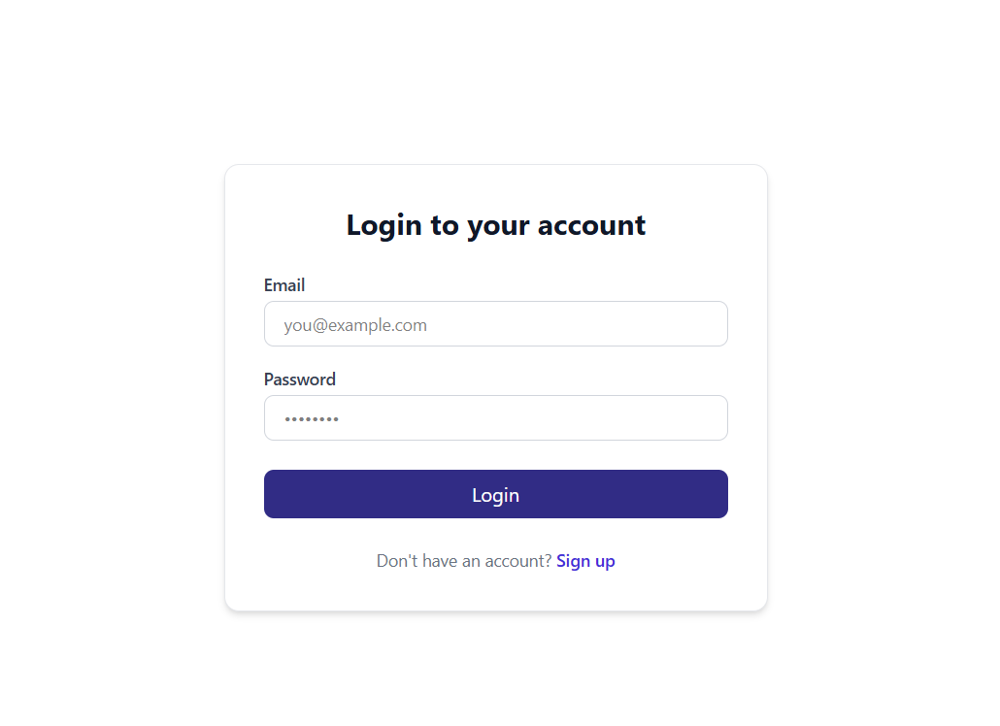
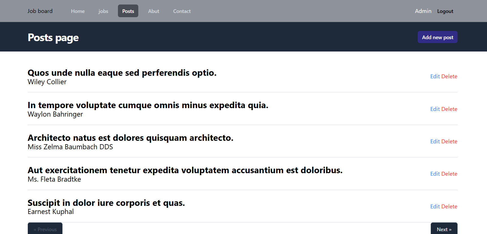
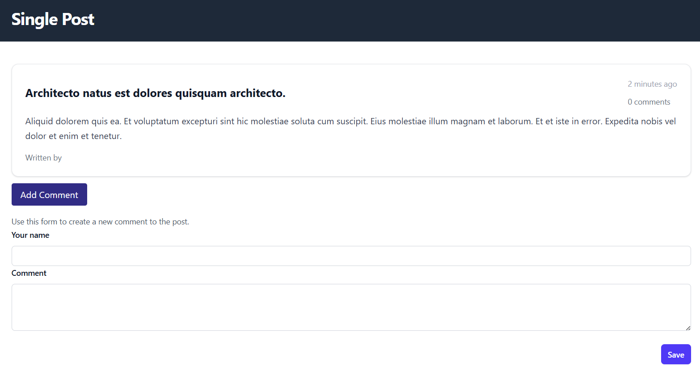

# Laravel Blog System

### 📌 Project Overview
A full-featured, secure Blog Application built with **Laravel**. This platform provides a complete content management workspace, featuring a robust multi-role authentication system, dynamic interactive comments, and full administrative capabilities (CRUD operations) for managing publications.

### 🔑 Key Features
* **Multi-Role Access Control:** Secure authentication paths partitioning permissions for **Admin**, **Editor**, and **Standard Users**.
* **Complete Content CRUD:** Dynamic post management dashboard featuring publication controls, active pagination, and smooth data flow.
* **Interactive Feedback Loops:** Integrated comment section within dedicated single-post layouts allowing user engagement.
* **Optimized Persistence Layer:** Engineered with clean Eloquent ORM mapping and data relationships to maintain absolute referential integrity.

* **Dashboard & Publications Control:** Full listing with server-side pagination and operational links (Edit/Delete).
* **Identity Management:** Standardized authentication and gatekeeping interfaces.
* **Deep-Dive Navigation:** Dedicated single-post views coupled with interactive comment generation modules.

### 🛠 Tech Stack
* **Framework:** Laravel 11 (PHP & OOP Architecture)
* **Database:** MySQL (Schema Optimization, Migrations & Seeders)
* **Presentation Layer:** Clean & Responsive UI Styling (Tailwind CSS styled layout)
* **Architecture:** Model-View-Controller (MVC)

### 📈 Current Status & Roadmap
- [x] Responsive Authentication Forms & Session Security.
- [x] Multi-Role Gatekeeping Logic (Admin/Editor/User).
- [x] Post Infrastructure & Pagination Controls.
- [x] Single Post Deep-Dive Rendering Layout.
- [🔄] **In Progress:** Polishing dynamic comment association and relationship styling.

## 📷 Screenshots

---
*Developed with focus on clean code and robust Laravel backend patterns.* 💻
